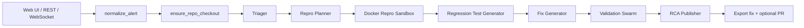

# Band-of-Agents - Current Codebase Report

Generated: 2026-06-16

## Overview

Band-of-Agents is an incident response pipeline that accepts an alert, normalizes it, optionally clones or resolves a repository, reproduces the issue in Docker, writes a regression test, generates two candidate fixes, validates them in a concurrent Docker swarm, and publishes an RCA plus optional GitHub PR output. The current codebase has two execution paths:

- The FastAPI orchestrator in [backend/agent_loop.py](backend/agent_loop.py) drives the full repo -> fix -> validate -> RCA flow.
- The Band SDK runtime in [backend/band_runtime.py](backend/band_runtime.py) keeps native agent-thread handoffs, but it does not run Docker validation or PR push.

## System Architecture



The orchestrator lives in [backend/main.py](backend/main.py) and exposes the incident APIs. It receives an alert, normalizes it, and streams `AgentEvent` objects over WebSocket while the pipeline advances through `triage -> repro -> test -> fix -> validate -> rca -> done/failed`.

The code path is split into four layers:

- API and transport: [backend/main.py](backend/main.py)
- Orchestration and Docker execution: [backend/agent_loop.py](backend/agent_loop.py)
- Alert and repository shaping: [backend/alert_normalize.py](backend/alert_normalize.py), [backend/repo_access.py](backend/repo_access.py), [backend/repo_stack.py](backend/repo_stack.py)
- Output/export and PR pushing: [backend/fix_export.py](backend/fix_export.py), [backend/git_output.py](backend/git_output.py)

## Directory Structure

- [backend/main.py](backend/main.py) - FastAPI app, `/health`, `/metrics`, `/demo/alert`, `/incidents`, `/ws/incidents`, fix/report download endpoints.
- [backend/agent_loop.py](backend/agent_loop.py) - core orchestrator, fallback agents, Docker sandbox executor, validation swarm, and event emission.
- [backend/schemas.py](backend/schemas.py) - all Pydantic models and enums for alerts, handoffs, events, validation, and RCA.
- [backend/inference.py](backend/inference.py) - OpenAI-compatible client routing, spend/token guardrails, JSON-only generation.
- [backend/alert_normalize.py](backend/alert_normalize.py) - normalizes webhook/UI/demo alerts into one contract.
- [backend/repo_access.py](backend/repo_access.py) - repository checkout, safe path validation, bounded file loading.
- [backend/repo_stack.py](backend/repo_stack.py) - stack detection and Docker defaults for demo Python, Python, and Node repos.
- [backend/band_runtime.py](backend/band_runtime.py) - Band SDK adapter runtime and handoff envelopes.
- [backend/fix_export.py](backend/fix_export.py) - persists patch/test artifacts and replication instructions, applies patch to the host repo when possible.
- [backend/git_output.py](backend/git_output.py) - branch creation, commit, push, and PR creation.
- [frontend/app/page.tsx](frontend/app/page.tsx) - Next.js incident console, WebSocket client, and local demo/GitHub input forms.
- [frontend/components/](frontend/components/) - chat, changes, input, and report panes.
- [frontend/lib/](frontend/lib/) - event grouping, chat rendering, and unified-diff parsing.
- [scripts/start.ps1](scripts/start.ps1) / [scripts/start.sh](scripts/start.sh) - local launcher scripts.
- [tests/](tests/) - orchestration, guardrail, Docker, API, and UI regression tests.
- [BAND_RUNTIME.md](BAND_RUNTIME.md) - short comparison of the Band runtime vs the FastAPI orchestrator.

## Band Integration

Current status:

- Band integration is present and functional for native agent-thread handoffs.
- The Band path is intentionally narrower than the orchestrator path: it stops after RCA and does not execute Docker validation or push a PR.
- The orchestrator remains the authoritative path for the full validation pipeline.

Exact adapter usage in [backend/band_runtime.py](backend/band_runtime.py):

- `create_band_agents()` loads stage agent IDs from `agent_config.yaml` via `load_agent_config(...)`.
- It creates one `band.Agent` per stage with `Agent.create(adapter=CustomAdapter(...), agent_id=..., api_key=..., ws_url=..., rest_url=...)`.
- `CustomAdapter.on_message(...)` parses inbound JSON, reconstructs or initializes `IncidentState`, calls the stage agent through `IncidentAgent.run(...)`, merges the output back into state, and sends a JSON handoff payload to the next mention.
- The Band stage order is `TRIAGE -> REPRO -> TEST -> FIX -> RCA`.
- `_merge_stage_output(...)` stores `context`, `repro`, `tests`, `candidate_patches`, `fix`, and `rca` back onto the shared state.
- The payload envelope uses `message_type: "band.handoff.v1"` and includes `stage`, `agent`, `payload`, and `state`.

Practical limitation:

- Docker repro, Docker validation, and PR push are handled by the orchestrator path, not the Band runtime path.

## Sample Workflow

1. A client sends an alert to `POST /incidents` or opens `WebSocket /ws/incidents` with `{ "alert": { ... } }`.
2. [backend/alert_normalize.py](backend/alert_normalize.py) coerces the alert into one shape, fills defaults, and derives `repo_path`, `repo_url`, `service_short`, `severity`, `impact`, and `auto_pr`.
3. [backend/repo_access.py](backend/repo_access.py) resolves or clones the repository when a `repo_url` is available.
4. [backend/repo_stack.py](backend/repo_stack.py) detects demo Python, Python, or Node layout and injects Docker defaults such as `docker_image`, `setup_command`, `repro_command`, and `validation_command` when the alert did not already supply them.
5. The orchestrator emits a `queued` event and begins triage.
6. The triager returns `IncidentContext`.
7. The repro agent returns `ReproPlan`; then `run_repro_pass1(...)` executes the command in a Docker container and records `ReproExecution`.
8. The test agent returns `RegressionTests`.
9. The fix stage returns exactly two candidate patches in `CandidatePatches`.
10. The validation swarm applies each patch in a separate Docker container, runs the build/test command, and keeps the first passing candidate.
11. The RCA agent produces `RCAReport` with the winning patch, validation summary, and final markdown.
12. Finalization exports `fix.patch`, the regression test, and `REPLICATE.md`; if `auto_pr` is enabled and GitHub credentials are present, it can also open a PR.

## Tech Stack & Dependencies

Backend:

| Component | Current version / dependency |
|---|---|
| Python | `>= 3.11` |
| FastAPI | `fastapi>=0.115.0` |
| Uvicorn | `uvicorn[standard]>=0.32.0` |
| Docker SDK | `docker>=7.1.0` |
| Pydantic | `pydantic>=2.9.0` |
| OpenAI-compatible client | `openai>=1.55.0` |
| dotenv loader | `python-dotenv>=1.0.1` |
| GitHub API | `PyGithub>=2.1.0` |
| Band SDK | `band-sdk>=1.0.0` |

Frontend:

| Component | Current version / dependency |
|---|---|
| Next.js | `15.2.4` |
| React | `19.0.0` |
| React DOM | `19.0.0` |
| TypeScript | `5.8.2` |

Install:

```bash
pip install -e ".[dev]"
cd frontend
npm install
```

## Agent Handoff Data Contracts

### Core pipeline models

| Stage | Input | Output model | Exact fields |
|---|---|---|---|
| Triage | `RunRequest.alert: dict[str, Any]` | `IncidentContext` | `service: str`, `environment: str = "unknown"`, `error_signature: str`, `severity: Severity`, `impact: str`, `suspected_components: list[str] = []`, `evidence: list[str] = []`, `interpretations: list[str] = []`, `investigation_plan: list[str] = []` |
| Repro planning | `IncidentContext` + repo files | `ReproPlan` | `confirmed: bool`, `assumptions: list[str] = []`, `steps: list[str]`, `expected_failure: str`, `required_data: list[str] = []` |
| Repro execution | `ReproPlan` | `ReproExecution` | `image: str`, `command: str`, `exit_code: int | None = None`, `timed_out: bool = False`, `failure_observed: bool = False`, `logs: str = ""`, `stack_trace: str = ""`, `error: str | None = None` |
| Test generation | `ReproExecution` + repo files | `RegressionTests` | `framework: str = "pytest"`, `test_files: list[str] = []`, `test_code: str`, `run_command: str = "pytest"`, `acceptance_criteria: list[str] = []` |
| Fix generation | `RegressionTests` + repo files + repro logs | `CandidatePatches` | `candidates: list[CodePatch]` with exactly 2 items |
| Patch shape | inside `CandidatePatches` | `CodePatch` | `summary: str`, `files_changed: list[str] = []`, `patch_unified_diff: str`, `risk_notes: list[str] = []`, `rollback_plan: str` |
| Validation | `CandidatePatches` + `RegressionTests` | `PatchValidationResult` | `candidate_index: int`, `validation_passed: bool`, `timed_out: bool = False`, `exit_code: int | None = None`, `logs: str = ""`, `error: str | None = None`, `patch_summary: str | None = None` |
| Validation aggregation | list of `PatchValidationResult` | `ValidationSwarmResult` | `winning_candidate_index: int | None = None`, `winning_patch: CodePatch | None = None`, `results: list[PatchValidationResult] = []` |
| RCA | winning patch + validation + context | `RCAReport` | `title: str`, `incident_summary: str`, `customer_impact: str`, `root_cause: str`, `timeline: list[str] = []`, `remediation: list[str] = []`, `prevention: list[str] = []`, `git_branch: str | None = None`, `commit_message: str | None = None`, `patch_unified_diff: str | None = None`, `validation_summary: str | None = None`, `final_markdown: str` |

### Shared wrappers

| Model | Fields |
|---|---|
| `AgentHandoff` | `from_agent: str`, `to_agent: str`, `stage: Stage`, `mention: str`, `payload: dict[str, Any]`, `message_type: str = "band.handoff.v1"`, `summary: str | None = None`, `created_at: datetime = now(UTC)` |
| `AgentEvent` | `run_id: UUID`, `stage: Stage`, `agent: str`, `status: Literal["queued", "active", "handoff", "complete", "failed", "done"]`, `payload: dict[str, Any] = {}`, `error: str | None = None`, `created_at: datetime = now(UTC)` |
| `IncidentState` | `run_id`, `current_stage`, `max_steps = 8`, `steps_run = 0`, `raw_alert`, `context`, `repro`, `repro_execution`, `candidate_patches`, `fix`, `tests`, `validation`, `rca`, `band_thread`, `events`, `errors`, `repo_path`, `repo_full_name`, `repo_files`, `fix_export` |
| `RunRequest` | `alert: dict[str, Any]` |
| `RunResult` | `state: IncidentState` |

### Stage order

- Orchestrator: `triage -> repro -> test -> fix -> validate -> rca -> done/failed`
- Band runtime: `triage -> repro -> test -> fix -> rca`

## Runtime Configuration Table

### Environment variables

| Variable | Type | Default | Notes |
|---|---|---|---|
| `LIVE_LLM_ENABLED` | bool | `false` | Enables live JSON LLM calls. When `false`, model calls raise `GuardrailBlocked` and fallback logic is used. |
| `MAX_RUN_USD` | float | `0` | Spend guard for a whole incident run. |
| `MAX_RUN_TOKENS` | int | `4000` | Total token guard across the run. |
| `REQUEST_TIMEOUT_SECONDS` | float | `20` | LLM request timeout per call. |
| `MAX_PROMPT_TOKENS` | int | `2500` | Rejects prompts that are too large before a request is made. |
| `MAX_AGENT_TOKENS` | int | `900` | Completion budget per LLM request. |
| `AIML_MODEL` | string | `gpt-4o` | Default AIML provider model. |
| `FEATHERLESS_MODEL` | string | `Qwen/Qwen2.5-Coder-32B-Instruct` | Default Featherless model. |
| `AIML_BASE_URL` | string | `https://api.aimlapi.com/v1` | AIML-compatible endpoint. |
| `FEATHERLESS_BASE_URL` | string | `https://api.featherless.ai/v1` | Featherless-compatible endpoint. |
| `OPENROUTER_BASE_URL` | string | `https://openrouter.ai/api/v1` | OpenRouter-compatible endpoint. |
| `OPENROUTER_MODEL` | string | `openai/gpt-oss-120b:free` | OpenRouter fallback model. |
| `AIML_API_KEY` | string | missing | Primary AIML credential. |
| `AIML_API_KEY_2` | string | falls back to `AIML_API_KEY` | Secondary AIML credential. |
| `FEATHERLESS_API_KEY` | string | missing | Primary Featherless credential. |
| `FEATHERLESS_API_KEY_2` | string | falls back to `FEATHERLESS_API_KEY` | Secondary Featherless credential. |
| `OPENROUTER_API_KEY` | string | missing | OpenRouter credential. |
| `TRIAGE_MODEL` | string | `gpt-4o-mini` | Per-agent override for triage. |
| `REPRO_MODEL` | string | `Qwen/Qwen2.5-Coder-32B-Instruct` | Per-agent override for repro planning. |
| `REGRESSION_TEST_MODEL` | string | `Qwen/Qwen2.5-Coder-32B-Instruct` | Per-agent override for test generation. |
| `PATCH_GENERATOR_MODEL` | string | `Qwen/Qwen2.5-Coder-32B-Instruct` | Per-agent override for fix generation. |
| `RCA_MODEL` | string | `openai/gpt-oss-120b:free` | Per-agent override for RCA generation. |
| `SHARED_DEPLOYMENT` | bool | `false` | Forces shared-deployment checks. |
| `REQUIRE_DOCKER` | bool | derived from `SHARED_DEPLOYMENT` | Overrides Docker-at-startup behavior when set. |
| `INCIDENT_API_KEY` | string | unset | Protects `/incidents` and `/ws/incidents` when configured or in shared mode. |
| `GITHUB_WEBHOOK_SECRET` | string | unset | Required in shared deployment and for webhook verification. |
| `ENFORCE_GITHUB_WEBHOOK_SECRET` | bool | `false` | Forces webhook secret validation outside shared deployment. |
| `CORS_ORIGINS` | CSV string | `http://localhost:3000,http://127.0.0.1:3000` | Allowed browser origins. |
| `REPOS_ROOT` | path | `~/.band-repos` | Allowed root for repository checkouts. |
| `RUNS_DIR` | path | `~/.band-runs` | Event-log and artifact output directory. |
| `RUNS_PERSIST` | bool | `true` | Controls JSONL run-event persistence. |
| `AUTO_PR_ENABLED` | bool | `false` | Default `auto_pr` for non-GitHub alerts. |
| `GITHUB_TOKEN` | string | unset | Used for clone/push/PR flows when no per-alert token exists. |
| `GITHUB_PR_BASE_BRANCH` | string | `main` | Base branch for clone/pull and PR creation. |
| `GIT_BOT_NAME` | string | `Band Bot` | Git identity used for commits. |
| `GIT_BOT_EMAIL` | string | `bot@users.noreply.github.com` | Git identity used for commits. |
| `BAND_USERNAME` | string | empty | Used when deriving Band participant names. |
| `REPO_PATH` | path | current working directory | Default repo path for Band runtime state creation. |
| `REPO_FULL_NAME` | string | empty | Default GitHub owner/repo for Band runtime state creation. |
| `THENVOI_WS_URL` | string | `wss://app.band.ai/api/v1/socket/websocket` | Band websocket endpoint. |
| `THENVOI_REST_URL` | string | `https://app.band.ai` | Band REST endpoint. |
| `NEXT_PUBLIC_API_URL` | string | `http://localhost:8000` | Frontend API base URL. |
| `NEXT_PUBLIC_INCIDENT_API_KEY` | string | empty | Frontend-auth header/query value for the websocket. |

### Alert payload keys

| Key | Type | Default / alias behavior | Notes |
|---|---|---|---|
| `service` | string | derived from repo or `unknown-service` | Primary service identifier. |
| `service_short` | string | derived from `repo_full_name` or `service` | Leaf service name used in UI and triage. |
| `repo_full_name` | string | derived from `repo_url` / `service` | GitHub `owner/repo`. |
| `repo_url`, `repository_url`, `github_url`, `repo_link`, `repository` | string | derived from `repo_full_name` when possible | Accepted aliases for repository location. |
| `repo_path` | string | derived from `REPOS_ROOT` + repo name or service | Local checkout path. |
| `error`, `error_message`, `message`, `title`, `error_details`, `body`, `text` | string | `unknown-error` | Free-text incident description. |
| `severity` | string | `sev2` | Normalized to `sev1`/`sev2`/`sev3`/`sev4`. |
| `environment` | string | `unknown` | Typically `production`, `staging`, `ci`, `demo`, or `unknown`. |
| `impact` | string | `impact requires confirmation` | Customer impact description. |
| `auto_pr` | bool | `true` for GitHub flow, otherwise `AUTO_PR_ENABLED` | Controls PR push in finalization. |
| `github_token` | string | unset | Per-incident override for clone/push. |
| `commit_sha` | string | unset | Optional checkout pin. |
| `docker_image`, `container_image`, `image` | string | derived by repo stack or `python:3.11-slim` | Container image for repro/validation. |
| `container_workdir`, `workdir` | string | `/workspace` | Writable working directory inside the container. |
| `source_mount` | string | `/workspace_src` | Read-only host mount point inside the container. |
| `setup_command`, `docker_setup_command` | string | repo- or alert-derived default | Prep command before repro/validation. |
| `repro_command`, `failing_command`, `test_command` | string | `pytest` or repo-derived command | Docker repro command. |
| `validation_command` | string | falls back to regression test run command | Validation command when not inferred. |
| `build_command` | string | auto-detected or unset | Optional compile/build pass during validation. |
| `patch_strip` | int | `1` | `patch -pN` strip level. |
| `container_timeout_seconds`, `docker_timeout_seconds` | int | `60`, capped to `1..600` | Hard timeout per Docker container. |
| `docker_network_disabled`, `network_disabled` | bool | `false` | Disables container networking when true. |

## Docker Sandbox & Mount Mechanics

The Docker execution model is deliberately conservative:

- The host repository is mounted read-only into the container at `source_mount`, which defaults to `/workspace_src`.
- The container gets a separate writable copy under `workdir`, which defaults to `/workspace`.
- The working copy is built by tar-copying the mounted source into `/workspace` and stripping CRLF line endings in place.
- Heavy directories are excluded from the copy: `.git`, `venv`, `.venv`, `node_modules`, `__pycache__`, `.pytest_cache`, `.ruff_cache`, `.next`, `dist`, `build`, `.cursor`, and `agent-transcripts`.
- Containers are launched as `sleep 3600` jobs and are always removed after the step finishes or times out.
- Repro and validation steps execute through `sh -lc` inside the container.
- Patch application uses `patch --batch --forward --fuzz=3 -pN` first, then retries without fuzz if needed.
- The default strip level is `patch_strip = 1`, but alerts can override it.
- `_safe_relative_container_path(...)` strips a leading `/workspace/` prefix, rejects absolute paths, rejects `..`, and rejects path segments containing `:`.
- Alert paths that already point inside the container workdir are normalized back to container-relative paths before file upload.
- Container timeouts are clamped to `1..600` seconds, with a default of 60 seconds.

Repository stack detection in [backend/repo_stack.py](backend/repo_stack.py):

- `services/checkout/handler.py` present -> `demo-python`
- `package.json` present -> `node`
- `pyproject.toml`, `requirements.txt`, or `setup.py` present -> `python`

Those heuristics inject image/command defaults automatically when the alert did not already specify a Docker configuration.

## WebSocket Event Stream Spec

The websocket endpoint is [backend/main.py](backend/main.py)'s `WebSocket /ws/incidents`. The browser sends `{"alert": {...}}` to start a run and may also send `{"type": "pong"}` in response to server heartbeats. The server sends `{"type": "ping"}` every 30 seconds.

All pipeline messages are serialized `AgentEvent` objects with this envelope:

```json
{
  "run_id": "uuid",
  "stage": "triage",
  "agent": "Alert Triager",
  "status": "active",
  "payload": {},
  "error": null,
  "created_at": "2026-06-16T00:00:00Z"
}
```

Event types:

| Status | Typical stage / agent | Payload shape |
|---|---|---|
| `queued` | `stage=triage`, `agent=orchestrator` | `alert`, `pipeline`, `agents`, `run_id`, `docker_available`, `docker_message` |
| `active` | current stage agent or `Repro Sandbox` / `Validation Swarm` | `_stage_payload(...)` snapshot, or `{"timeout_seconds": ...}` for repro sandbox activation |
| `handoff` | after a stage finishes | `mention`, `from_agent`, `to_agent`, `summary`, `payload` |
| `complete` | stage finished successfully | the stage output model, with `repro_execution` included on repro completions |
| `failed` | orchestrator, repro sandbox, or validation swarm | `errors` plus any available `fix`, `fix_export`, `tests`, `rca`, and an `error` string |
| `done` | `stage=done`, `agent=orchestrator` | `rca`, `fix`, `validation`, `repo_full_name`, `branch`, `pr_url`, `pr_error`, `errors`, `fix_export` |

The orchestrator also stores the event stream on disk when `RUNS_PERSIST=true`, using `RUNS_DIR/<run_id>.jsonl`.

## Local Mocking & Testing Guide

`LIVE_LLM_ENABLED=false` is the default in [backend/inference.py](backend/inference.py). In that mode, live JSON calls are blocked and the code falls back to deterministic local behavior.

Good local testing patterns:

- Use `FallbackOnlyAgent`-style stubs, as demonstrated in [tests/test_band_collaboration.py](tests/test_band_collaboration.py).
- Monkeypatch `backend.agent_loop.run_repro_pass1` and `backend.agent_loop.run_validation_swarm` when you want orchestration coverage without a live Docker daemon.
- Keep the repo-specific contract tests small and focused: the codebase already has coverage for alert normalization, validation finalization, Docker deployment checks, and websocket behavior.

Useful commands:

```bash
pytest tests/test_band_collaboration.py -v
pytest tests/test_orchestrator_validation.py -v
pytest tests/test_orchestrator_finalize.py -v
pytest tests/test_inference_guardrails.py -v
pytest tests/test_main_api.py -v
```

For the full local suite:

```bash
pytest tests -v
ruff check backend tests
```

## Known Issues & Potential Bugs

- Docker is mandatory for the full orchestrator path. If the daemon is unavailable, repro and validation cannot complete.
- The slim container images assume the repo can install or already has tools like `patch`, `pytest`, or `npm`-based build commands available through `setup_command`.
- Validation only races two candidate patches. If both fail, time out, or cannot be applied, the run ends in `failed`.
- The validation swarm is fail-fast by design, so concurrent container behavior can surface timing-dependent edge cases if one container is slow to report a winner.
- The Repro stage system prompt currently mentions fields such as `expected_exit_code`, `files_involved`, and `environment_vars`, but the actual `ReproPlan` schema only contains `confirmed`, `assumptions`, `steps`, `expected_failure`, and `required_data`. That prompt/schema mismatch is a real maintenance risk.
- LLM output must stay within JSON schema limits. Oversized prompts can trip `MAX_PROMPT_TOKENS`, and live calls are blocked entirely when `LIVE_LLM_ENABLED=false` or when spend/token guardrails are exhausted.
- Repository resolution is constrained to `REPOS_ROOT` or the current project directory. Alerts that point elsewhere are rejected.
- The Band runtime intentionally omits Docker validation and PR push, so its fixes should be treated as unvalidated suggestions until they pass through the orchestrator.
- `run_validation_swarm(...)` and `run_repro_pass1(...)` depend on real Docker semantics, so mocks can diverge from production behavior if they do not emulate cleanup and patch application accurately.

## Run Instructions

### Windows

```powershell
.\scripts\start.ps1
```

That script starts the backend, waits for `/health`, and launches the frontend. If you want the headless demo path, run:

```powershell
.\scripts\start.ps1 -RunE2E
```

### Manual local run

```bash
pip install -e ".[dev]"
uvicorn backend.main:app --host 127.0.0.1 --port 8000
```

In a second terminal:

```bash
cd frontend
npm install
npm run dev
```

Then open `http://localhost:3000`.

### Band runtime

```bash
python -m backend.band_runtime
```

### Useful checks

```bash
curl http://127.0.0.1:8000/health
curl http://127.0.0.1:8000/metrics
```

## Current HTTP Endpoints

- `GET /health` - backend and Docker readiness information.
- `GET /metrics` - incident counters.
- `GET /demo/alert` - built-in checkout demo payload.
- `POST /incidents` - enqueue an incident run.
- `WebSocket /ws/incidents` - stream pipeline events.
- `GET /runs/{run_id}/fix.patch` - download the exported patch.
- `GET /runs/{run_id}/report.html` - download the self-contained incident report.

## Reference Files

- [README.md](README.md) contains the broader project overview and quick-start notes.
- [BAND_RUNTIME.md](BAND_RUNTIME.md) explains the difference between the orchestrator and Band runtime.
- [backend/schemas.py](backend/schemas.py) is the authoritative source for the data models listed above.
- [backend/agent_loop.py](backend/agent_loop.py) is the authoritative source for the orchestration and Docker behavior listed above.
